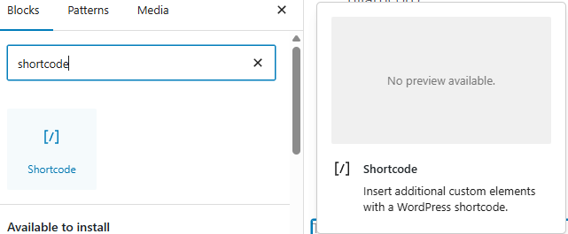

# Post to Hero Plugin

## Introduction

The **Post to Hero Plugin** is a WordPress plugin designed to enhance your website by creating visually appealing hero sections for posts. It is modular, scalable, and developer-friendly, making it easy to maintain and extend.

## Features

- **Shortcode Support**: Use `[post_to_hero]` to display hero sections.
- **Admin Settings**: Configure plugin settings via the WordPress admin panel.
- **Multilingual Support**: Built-in translations for English, Spanish, and French.
- **Frontend Optimization**: Enqueues only necessary assets for better performance.
- **Modular Architecture**: Clean separation of admin, public, and shortcode logic.

## Installation

1. Download the plugin files.
2. Upload the `post-hero` folder to the `/wp-content/plugins/` directory.
3. Activate the plugin through the 'Plugins' menu in WordPress.

## Usage

- Add the shortcode `[post_to_hero]` to any post or page.
- Customize the shortcode with parameters like `category` or `post_id`.
- See the available setting configurations via the WordPress admin panel under **Settings > Post to Hero**.

### Example Screenshots


_Selecting the shortcode block in the WordPress editor._


_Typing the `[post_to_hero]` shortcode in the editor._

## File Structure

```
post-hero/
├── post-hero.php                           # Main plugin file
├── includes/
│   ├── class-post-to-hero-loader.php       # Main loader class with singleton pattern
│   └── class-post-to-hero-shortcode.php    # Shortcode functionality
├── admin/
│   └── class-post-to-hero-admin.php        # Admin panel functionality
├── public/
│   └── class-post-to-hero-public.php       # Frontend functionality (CSS, JS)
└── assets/
    └── post-to-hero.css                     # External CSS file (optional)
```

## Development

### Adding New Features

1. Determine which class the feature belongs to.
2. If it's a new major feature, consider creating a new class.
3. Follow the existing naming conventions.
4. Update the loader class to include new files.

### File Naming Convention

- Classes: `class-post-to-hero-{feature}.php`
- Use lowercase with hyphens for file names.
- Use PascalCase for class names: `PostToHero{Feature}`.

### Class Structure

- Each class should have a clear, single responsibility.
- Use proper WordPress hooks and filters.
- Include proper documentation and comments.
- Follow WordPress coding standards.

## License

This plugin is open-source and distributed under the [GPLv2 or later](https://www.gnu.org/licenses/gpl-2.0.html) license.
